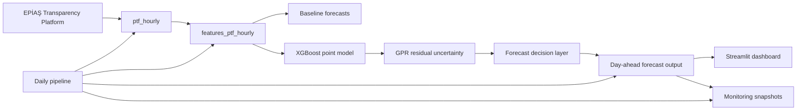

# EPİAŞ PTF Forecasting MVP

A Docker Compose based B2B energy forecasting SaaS MVP for the Turkish electricity market. The system ingests EPİAŞ Transparency Platform Day-Ahead Market Clearing Price data, stores it in PostgreSQL/TimescaleDB, builds leakage-aware hourly features, trains and evaluates forecasting models, generates a 24-hour day-ahead PTF forecast with uncertainty, and exposes the result through FastAPI and a Streamlit dashboard.

## Architecture overview



Core flow:

```text
EPİAŞ → ptf_hourly → features_ptf_hourly → baselines → XGBoost → GPR uncertainty
      → decision layer → day-ahead forecast → dashboard → monitoring
```

## MVP capabilities

- EPİAŞ PTF/MCP ingestion infrastructure with raw response storage.
- PostgreSQL + TimescaleDB time-series schema.
- Hourly PTF feature engineering.
- Baseline forecast evaluation.
- XGBoost point forecasting.
- Gaussian Process Regression residual uncertainty modeling.
- Forecast decision layer that selects the product-safe output.
- Day-ahead 24-hour forecast API/output table.
- Daily forecast pipeline runner with persisted step status.
- Monitoring snapshots for data freshness, data quality, forecast health, model quality, uncertainty quality, and risk distribution.
- Streamlit dashboard for forecast, pipeline, and monitoring inspection.
- MLflow tracking and artifact recovery.

## Tech stack

- Python 3.12
- FastAPI
- PostgreSQL + TimescaleDB
- Streamlit
- MLflow
- XGBoost
- scikit-learn / GaussianProcessRegressor
- pandas / NumPy
- Docker Compose
- pytest

## Quickstart

From the repository root:

```powershell
docker compose up -d --build
docker compose ps
```

Open:

- Dashboard: <http://localhost:8501>
- Swagger API: <http://localhost:8000/docs>
- MLflow: <http://localhost:5000>

Health checks:

```powershell
Invoke-RestMethod http://localhost:8000/health
Invoke-RestMethod http://localhost:8000/api/system/readiness
```

## Environment variables

Copy `.env.example` to `.env` for local overrides:

```powershell
Copy-Item .env.example .env
```

Important variables:

```env
POSTGRES_USER=pepias
POSTGRES_PASSWORD=pepias
POSTGRES_DB=pepias
DATABASE_URL=postgresql+psycopg://pepias:pepias@db:5432/pepias
MLFLOW_BACKEND_STORE_URI=postgresql+psycopg2://pepias:pepias@db:5432/mlflow

EPIAS_BASE_URL=https://seffaflik.epias.com.tr
EPIAS_AUTH_URL=https://giris.epias.com.tr
EPIAS_USERNAME=
EPIAS_PASSWORD=

DAILY_PIPELINE_ENABLED=false
DAILY_PIPELINE_RUN_TIME_LOCAL=13:00
DAILY_PIPELINE_TIMEZONE=Europe/Istanbul
```

Do not commit real EPİAŞ credentials. `.env` and `.env.*` are ignored by git except `.env.example`.

## Docker commands

```powershell
docker compose up -d --build
docker compose ps
docker compose logs api --tail=100
docker compose logs dashboard --tail=100
docker compose down
```

Optional scheduler profile:

```powershell
docker compose --profile scheduler up -d daily-pipeline-scheduler
```

The scheduler is disabled by default and only starts with the `scheduler` profile.

## Run tests

```powershell
docker compose run --rm api pytest
```

Expected current result:

```text
tests pass
```

## Generate a day-ahead forecast

API:

```powershell
$body = @{
  horizon_hours = 24
  model_version = "day_ahead_v1"
} | ConvertTo-Json

Invoke-RestMethod `
  -Method Post `
  -Uri http://localhost:8000/api/forecasts/ptf/day-ahead/generate `
  -ContentType "application/json" `
  -Body $body
```

CLI:

```powershell
docker compose exec api python scripts/generate_day_ahead_ptf.py --horizon-hours 24 --model-version day_ahead_v1
```

Inspect latest:

```powershell
Invoke-RestMethod http://localhost:8000/api/forecasts/ptf/day-ahead/latest
```

## Run the daily pipeline

Safe local demo mode uses existing data and skips live EPİAŞ ingestion:

```powershell
$body = @{
  skip_ingestion = $true
  skip_feature_build = $true
} | ConvertTo-Json

Invoke-RestMethod `
  -Method Post `
  -Uri http://localhost:8000/api/pipelines/daily-forecast/run `
  -ContentType "application/json" `
  -Body $body
```

CLI:

```powershell
docker compose exec api python scripts/run_daily_forecast_pipeline.py --skip-ingestion --skip-feature-build
```

Status:

```powershell
Invoke-RestMethod http://localhost:8000/api/pipelines/daily-forecast/status
```

## Generate a monitoring snapshot

API:

```powershell
$body = @{
  max_ptf_age_hours = 168
  expected_forecast_horizon_hours = 24
} | ConvertTo-Json

Invoke-RestMethod `
  -Method Post `
  -Uri http://localhost:8000/api/monitoring/ptf/snapshot `
  -ContentType "application/json" `
  -Body $body
```

CLI:

```powershell
docker compose exec api python scripts/build_monitoring_snapshot.py --max-ptf-age-hours 168 --expected-forecast-horizon-hours 24
```

Compact status:

```powershell
Invoke-RestMethod http://localhost:8000/api/monitoring/ptf/status
```

## One-command local demo helper

The helper is safe by default and does not retrain models or call live EPİAŞ ingestion.

```powershell
docker compose exec api python scripts/demo_local_mvp.py
docker compose exec api python scripts/demo_local_mvp.py --run-forecast
docker compose exec api python scripts/demo_local_mvp.py --run-pipeline
docker compose exec api python scripts/demo_local_mvp.py --run-monitoring
docker compose exec api python scripts/demo_local_mvp.py --all
```

## Turkish user-facing guides

- Turkish usage guide: [KULLANIM_REHBERI.md](KULLANIM_REHBERI.md)
- Turkish 10-minute demo script: [DEMO_TR.md](DEMO_TR.md)

## Key URLs

- Dashboard: <http://localhost:8501>
- Swagger API: <http://localhost:8000/docs>
- MLflow: <http://localhost:5000>
- Readiness: <http://localhost:8000/api/system/readiness>

## Useful database inspection

```powershell
docker compose exec db sh -c 'psql -U "$POSTGRES_USER" -d "$POSTGRES_DB" -c "SELECT COUNT(*) FROM ptf_hourly;"'
docker compose exec db sh -c 'psql -U "$POSTGRES_USER" -d "$POSTGRES_DB" -c "SELECT forecast_run_id, target_date, COUNT(*) FROM day_ahead_forecasts GROUP BY forecast_run_id, target_date ORDER BY MAX(generated_at) DESC LIMIT 5;"'
docker compose exec db sh -c 'psql -U "$POSTGRES_USER" -d "$POSTGRES_DB" -c "SELECT pipeline_run_id, status, target_date, forecast_run_id, started_at, finished_at FROM pipeline_runs ORDER BY started_at DESC LIMIT 5;"'
docker compose exec db sh -c 'psql -U "$POSTGRES_USER" -d "$POSTGRES_DB" -c "SELECT snapshot_id, status, created_at FROM monitoring_snapshots ORDER BY created_at DESC LIMIT 5;"'
```

## Known limitations

- This is an MVP, not a production trading system.
- Day-ahead feature construction uses latest known PTF history; it does not recursively feed predicted values into future lag features.
- EPİAŞ ingestion requires valid credentials for live authenticated calls.
- Model retraining is manual; the daily pipeline intentionally does not retrain XGBoost or GPR.
- Monitoring is snapshot-based and lightweight, not Prometheus/Grafana.
- Authentication, RBAC, CI/CD, cloud secrets, and production observability are intentionally out of scope for this MVP.

## Next roadmap

1. Add robust production scheduling and alerting.
2. Add model registry promotion workflow.
3. Add backtesting reports by delivery period and market regime.
4. Add richer exogenous drivers such as demand, renewables, outages, weather, and FX.
5. Add authenticated multi-tenant dashboard/API access.
6. Add CI/CD, cloud deployment, backups, and managed secrets.

## Final Validation Checklist

Run:

```powershell
docker compose up -d --build
docker compose ps
docker compose run --rm api pytest
Invoke-RestMethod http://localhost:8000/health
Invoke-RestMethod http://localhost:8000/api/system/readiness
```

Open:

- <http://localhost:8501>
- <http://localhost:8000/docs>
- <http://localhost:5000>

Expected:

- all services are healthy;
- tests pass;
- dashboard opens;
- readiness endpoint returns database/model/pipeline/monitoring summaries;
- Swagger shows EPİAŞ, feature, model, forecast, pipeline, monitoring, and system endpoints.
